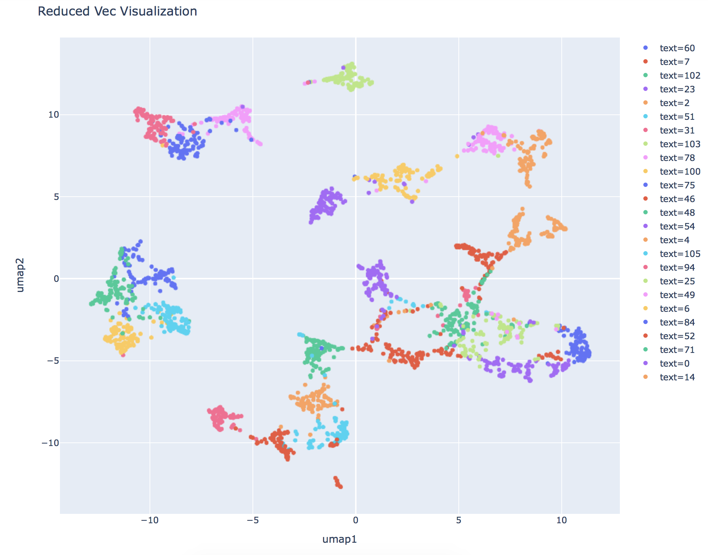
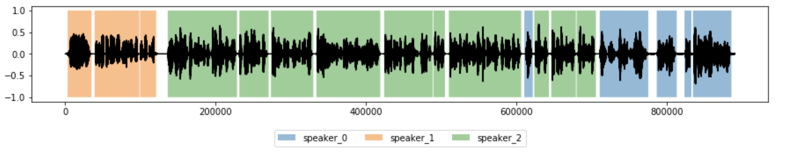

# Speaker Embedding for Diarization in PyTorch
## Installation
### Conda environment
To use this conda environment, you need to install [Miniconda](https://docs.conda.io/en/latest/miniconda.html), then run this command

`conda env create -f environment.yml`

### Install OpenVINO (Optional)
If you would like to use OpenVINO for inference. Please check [OpenVINO official Documentation](https://docs.openvinotoolkit.org/latest/_docs_install_guides_installing_openvino_linux.html) for the installation. This code utilizes OpenVINO 2020.1.023.

## Step 0: Download VCTK Dataset
We can easily download VCTK dataset using `torchaudio`. Please do to use `Part 0 - Download VCTK Dataset.ipynb` if you are stuck.

## Step 1: Training :muscle:
Simply run the code in the `Part 1 - Training.ipynb` notebook and you are good to go.

Here is the training process if you would want to learn more:
- Dataset Preparation <br>
    If you would like to use your own dataset, use folder structure as in VCTK:
    ```
    vctk_dataset
        txt
            speaker_1
                sentence_1.txt
                sentence_2.txt
            speaker_2
                sentence_1.txt
                sentence_2.txt
        wav48
            speaker_1
                sentence_1.wav
                sentence_2.wav
            speaker_2
                sentence_1.wav
                sentence_2.wav
    ```

- Dataset & Dataloader <br>
    I have created `VCTKTripletDataset` and `VCTKTripletDataloader` dan would prepare Triplet data to train the speaker embedding. Here is a quick look for you
    ```
    dataset = VCTKTripletDataset(wav_path, txt_path, n_data=3000, min_dur=1.5)
    dataloader = VCTKTripletDataloader(dataset, batch_size=32)
    ```
    In a nutshell, here is what it does:
    - Only audio longer than `min_dur` seconds is considered as data.    
    - Randomly choose 2 speakers, A and B, from the dataset folder.
    - Randomly choose 2 audios from A and 1 from B, mark it as anchor, positive, and negative.
    - Repeat `n_data` times. Now you have a dataset.
    - The dataset is loaded as minibatch of size `batch_size`.

- Architecture & Config <br>
    Simply create the model architecture you would like to use. I have made one sample for you in `src/model.py`. You can directly use it by simply changing the hyperparameters. Please follow the notebook if you are confused.

    :exclamation: Note: If you would like to use custom architecture in OpenVINO, make sure it is compatible with OpenVINO model optimizer and inference engine.

- Training Preparation <br>
    Set up the `model`, `criterion`, `optimizer`, and `callback` here.

- Training <br>
    As what it says, running the code will train the model

## Step 2: Sanity Check :pill:
While training, you can visualize the embedding to confirm if the model actually learns. Similarly, I have prepared `VCTKSpeakerDataset` and `VCTKSpeakerDataloader` for this purpose. Here is a sample visualization using [Uniform Manifold Approximation and Projection](https://arxiv.org/abs/1802.03426).



## Step 3: Speaker Diarization :robot:
I have prepared a `PyTorchPredictor` and `OpenVINOPredictor` object for speaker diarization. Here is a sneak peek:
```
p = PyTorchPredictor(config_path, model_path, max_frame=45, hop=3)
p = OpenVINOPredictor(model_xml, model_bin, config_path, max_frame=45, hop=3)
```
To use it, simply input the arguments and use `.predict(wav_path)` and it will return the diarization timestamp and speakers. The timestamps are in seconds.

You can use this [sample dataset in Kaggle](https://www.kaggle.com/wiradkp/minispeakerdiarization2) to test the speaker diarization. For example:
```
p = PyTorchPredictor("model/weights_best.pth", "model/configs.pth")
timestamps, speakers = p.predict("dataset/test/test_1.wav", plot=True)
```
setting `plot=True` provides you with the diarization visualization like this


If you would like to use OpenVINO, use `.to_onnx(fname, outdir)` to convert the model into onnx format.
```
p.to_onnx("speaker_diarization.onnx", "model/openvino")
```

## End notes :heart:
I hope you like the projects. I made this repo for educational  purposes so it might need further tweaking to reach production level. Feel free to create an issue if you need help, and I hope I'll have the time to help you. Thank you.